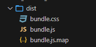
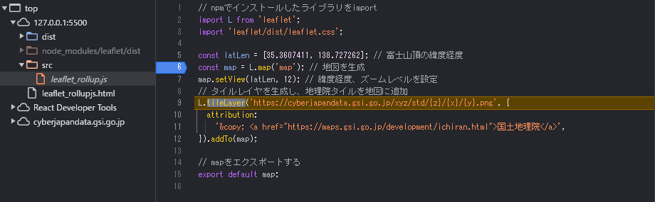

# npmでインストールしたライブラリをブラウザで利用できるようにする手順(ReactやVue.jsなどフレームワークは未使用)


## はじめに

(Webアプリの場合)npmでインストールしたライブラリは、CDNから読み込むような感じでは使えません

`import`や `require`でライブラリを読み込み、さらにそれを[バンドル](https://qiita.com/kome1996/items/1731e53cfefed79eafcc)する必要があります

モジュール形式でjsファイルを作成すると型定義を利用できたり、JSファイルの読み込み順(依存関係)に悩むことがなくなるなど様々な利点があります

そこで、できるだけ簡単かつ使いまわせる形で`バンドル`する方法をまとめました([rollup.js](https://rollupjs.org/)を使います)

※VSCodeでは、npmでインストールしたライブラリを利用すれば(TypeScriptを利用しなくても)型定義のサポートを受けることができます

### こんな状況を想定

* 今までnpmを使ってこなかったWebアプリケーションから、npmのライブラリを利用したい
* VSCodeが型定義を表示してくれないので不便(全てany型になってしまう)
* ReactやVue.jsを使えばnpmのライブラリ読み込めるけど、フレームワーク無しでは読み込み方がわからない


サンプルとして、[Leaflet](https://leafletjs.com/) という地図ライブラリを使ったアプリを作成します

[Leaflet](https://leafletjs.com/)は、CDNを利用した従来の読み込み方法と、npmのモジュール両方で利用することができるため、2パターンでWebアプリを作成してみます


## ①従来のCDN＋&lt;script&gt;タグで読み込んで地図を表示

[Leaflet](https://leafletjs.com/)公式[Quick Start Guide](https://leafletjs.com/examples/quick-start/#:~:text=example%20stand%2Dalone.-,Preparing%20your%20page,-Before%20writing%20any)ページのサンプルをもとに、地図を国土地理院の[地理院タイル](https://maps.gsi.go.jp/development/ichiran.html)に変更したサンプルプログラムです

### ポイント
* ライブラリjsファイルは、公式サンプルの通りCDN(unpkg.com)から読み込む
* cssを読み込んだ後に、`leaflet.js`を読み込む
* 地図を画面全体に表示するためのstyleを追加
* js部分はコメント参照  (経度緯度を指定して地図を表示)

```html:leaflet_conventional.html
<!DOCTYPE html>
<!DOCTYPE html>
<html lang="ja">
<head>
  <meta charset="utf-8">
  <title>leaflet conventional js sample</title>
  <link rel="stylesheet" href="https://unpkg.com/leaflet@1.9.4/dist/leaflet.css"
    integrity="sha256-p4NxAoJBhIIN+hmNHrzRCf9tD/miZyoHS5obTRR9BMY=" crossorigin="" />
  <script src="https://unpkg.com/leaflet@1.9.4/dist/leaflet.js"
    integrity="sha256-20nQCchB9co0qIjJZRGuk2/Z9VM+kNiyxNV1lvTlZBo=" crossorigin=""></script>
  <style>
    /* 画面全体に地図を表示 */
    body { margin: 0 }
    #map { height: 100vh; }
  </style>
</head>
<body>
  <div id="map"></div>
  <script>
    const latLen = [35.3607411, 138.727262]; // 富士山頂の緯度経度
    const map = L.map('map'); // 地図を生成
    map.setView(latLen, 12);  // 緯度経度、ズームレベルを設定
    // タイルレイヤを生成し、地理院タイルを地図に追加
    L.tileLayer('https://cyberjapandata.gsi.go.jp/xyz/std/{z}/{x}/{y}.png', {
      attribution: '&copy; <a href="https://maps.gsi.go.jp/development/ichiran.html">国土地理院</a>'
    }).addTo(map);
  </script>
</body>
</html>
```

* 実行するとこんな感じで富士山が表示されます（拡大、縮小、移動もできます）


https://murasuke.github.io/npm_leaflet_rollup/leaflet_conventional.html

次は、まったく同じ機能のWebアプリを`npm`環境で作成します

## ②npmでインストールしたライブラリを利用して地図を表示

①で作成したjsソースを流用して、npm環境に移植します(node.jsはインストール済みの前提)

手順
1. npmで実行とビルド(バンドル)に必要なライブラリをインストールする
1. 地図を表示するjsファイルを作成する
1. 作成したjsファイルと、npmでインストールしたライブラリをバンドルするスクリプトを作成する
1. jsファイルをビルド(バンドル)する
1. バンドルしたjsを読み込むhtmlファイルを作成する


### 1. npmで実行とビルド(バンドル)に必要なライブラリをインストールする

まず[Leaflet](https://leafletjs.com/)本体と、バンドルに必要なライブラリをインストールします

```bash
npm init -y
npm i leaflet
npm i -D rollup rollup-plugin-delete rollup-plugin-import-css @rollup/plugin-node-resolve  rollup-plugin-peer-deps-external @rollup/plugin-commonjs @rollup/plugin-terser
```
| ライブラリ名 | 概要 |
| ---- | ---- |
| [leaflet](https://www.npmjs.com/package/leaflet) | 地図表示ライブラリ |
| [rollup](https://github.com/rollup/rollup) | JavaScript 用のモジュール バンドラー(以降はビルド用のプラグイン) |
| [rollup-plugin-peer-deps-external](https://www.npmjs.com/package/rollup-plugin-peer-deps-external) | 重複した依存関係を削除(バンドルサイズを削減) |
| [rollup-plugin-delete](https://www.npmjs.com/package/rollup-plugin-delete) | 出力先を削除するために利用 |
| [rollup-plugin-import-css](https://www.npmjs.com/package/rollup-plugin-import-css) | javascriptからcssを読み込むために利用 |
| [@rollup/plugin-node-resolve](https://www.npmjs.com/package/@rollup/plugin-node-resolve)   | importしたライブラリの依存関係を解決して、node_moduleから見つける |
| [@rollup/plugin-commonjs](https://www.npmjs.com/package/@rollup/plugin-commonjs) | CommonJSモジュールをES6に変換(バンドルできるようになる) |
| [@rollup/plugin-terser](https://www.npmjs.com/package/@rollup/plugin-terser) | jsファイルを圧縮(minifi)する |

### 2. 地図を表示するjsファイルを作成する

`①従来のCDN＋<script>タグで読み込んで地図を表示`で作成したスクリプトをそのまま流用します

ソースの変更(追加)は下記2か所です
* 必要なライブラリ、cssを`import`する
* 外部から利用可能にするために`export`する

```javascript:./src/leaflet_rollup.js
// npmでインストールしたライブラリをimport
import L from 'leaflet';
import 'leaflet/dist/leaflet.css';

const latLen = [35.3607411, 138.727262]; // 富士山頂の緯度経度
const map = L.map('map'); // 地図を生成
map.setView(latLen, 12); // 緯度経度、ズームレベルを設定
// タイルレイヤを生成し、地理院タイルを地図に追加
L.tileLayer('https://cyberjapandata.gsi.go.jp/xyz/std/{z}/{x}/{y}.png', {
  attribution: '&copy; <a href="https://maps.gsi.go.jp/development/ichiran.html">国土地理院</a>',
}).addTo(map);

// mapをエクスポートする
export default map;
```
### 3. 作成したjsファイルと、npmでインストールしたライブラリをバンドルするスクリプトを作成する

rollup.jsを利用して、モジュールをバンドルするスクリプトを作成します

(ファイルの拡張子はmjsにします。jsだとrollup.jsがcommonJSとして読み込みエラーとなるため)
```javascript:rollup.config.mjs
import peerDepsExternal from 'rollup-plugin-peer-deps-external';
import resolve from '@rollup/plugin-node-resolve';
import css from 'rollup-plugin-import-css';
import commonjs from '@rollup/plugin-commonjs';
import del from 'rollup-plugin-delete';
import terser from '@rollup/plugin-terser';

export default {
  input: './src/leaflet_rollup.js', // バンドル対象のファイル名
  output: {
    file: './dist/bundle.js', // 出力ファイル名
    format: 'esm', // ESモジュール形式で出力する
    sourcemap: true, // ソースマップを作成(元jsファイルでデバッグできる)
  },

  plugins: [
    peerDepsExternal(), // 重複した依存関係を削除(バンドルサイズを削減)
    del({ targets: 'dist/*' }), // 出力先を削除
    css({ output: 'bundle.css' }), // importしたcssファイルの出力先
    resolve(), // importしたライブラリの依存関係を解決して、node_moduleから見つける
    commonjs(), // commonjs形式のライブラリを読み込み可能にする
    terser(), // minify(圧縮)
  ],
};
```

### 4. jsファイルをビルド(バンドル)する

バンドルは`rollup`を直接呼び出すか
```bash
$ npx rollup -c

./src/leaflet_rollup.js → ./dist/bundle.js...
created ./dist/bundle.js in 532ms
```

package.json の`scripts'に登録して実行します
```json:package.json
  "scripts": {
    "build": "rollup -c"
  },
```
```bash
$ npm run build

> npm_leaflet_rollup@1.0.0 build
> rollup -c

./src/leaflet_rollup.js → ./dist/bundle.js...
created ./dist/bundle.js in 532ms
```

./dist フォルダにバンドルされたファイル(とmapファイル)が生成されます



* mapファイルとは

  変換前のコードと変換後のコード(行の位置)を紐づけるファイルです。
  jsファイルをビルドすると、圧縮や結合されることによりデバッグが困難になりますが、mapファイルがあれば、変換前のjsソースでデバッグを行うことができるようになります。

### 5. バンドルしたjsを読み込むhtmlファイルを作成する

バンドル後のjsファイル`./dist/bundle.js`をhtmlファイルで読み込みます

* jsファイルはESモジュール形式なので、`type="module"`が必要です

```html:leaflet_rollupjs.html
<!DOCTYPE html>
<html lang="ja">
<head>
  <meta charset="utf-8">
  <title>leaflet npm bundle js sample</title>
  <style>
    /* 画面全体に地図を表示 */
    body { margin: 0 }
    #map { height: 100vh; }
  </style>
  <link rel="stylesheet" href="./dist/bundle.css"> <!-- cssを読み込む -->
  <script type="module">
    // バンドルしたファイルを読み込む
    // type="module"なので、DOMのロード後に実行される
    import map from './dist/bundle.js';
  </script>
</head>
<body>
  <div id="map"></div>
</body>
</html>
```

ブラウザに表示すると`①従来のCDN＋&lt;script&gt;タグで読み込んで地図を表示`と全く同一の地図が表示されます


https://murasuke.github.io/npm_leaflet_rollup/leaflet_rollupjs.html

minifyしてありますが、mapファイルを生成しているためバンドル前のjsファイルでデバッグすることができます。


